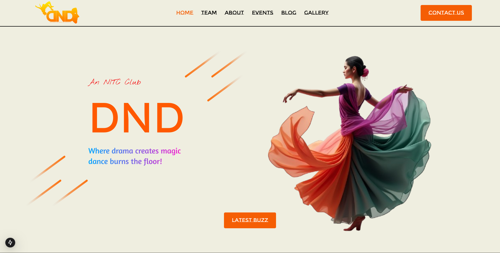

Forum for Dance and Dramatics @ NIT Calicut

Follow the instructions below:

Repo is in NEXT JS
Use Tailwind CSS for 95% of CSS

TO DESIGN

Here is figma design: https://www.figma.com/design/XkRLxvi0y52gy8YcIo3NK8/DnD?node-id=0-1&node-type=canvas&t=TI3Jyhwjp7f1SYUL-0

TO CODE 

1. Open your terminal and paste following command to clone this repo,
   git clone https://github.com/DND2024/dnd-website.git

2. Move to directory and open in vscode,
   cd dnd-website
   code .

3. Install necessary packages,
   npm i

4. Create new branch and start work,
   git branch branch-name

5. Run the development,
   npm run dev

6. Push your code

Happy Coding...
